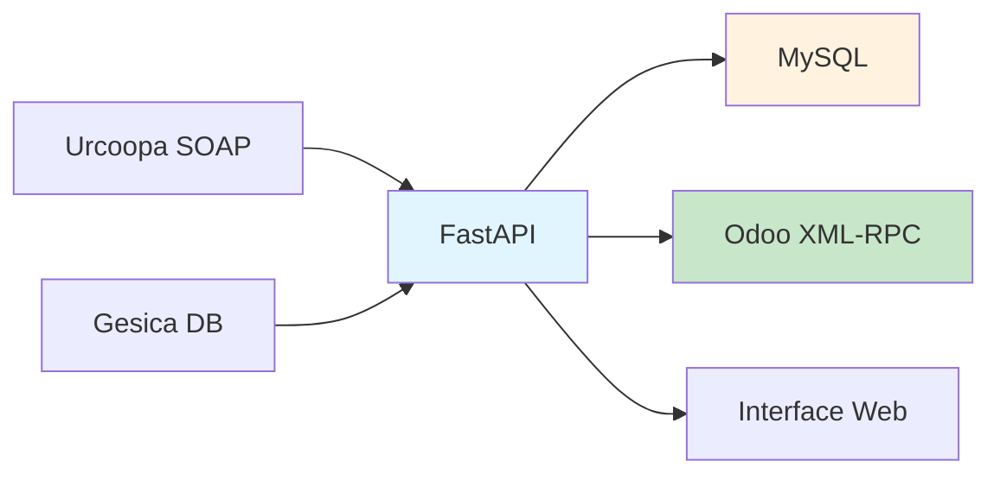
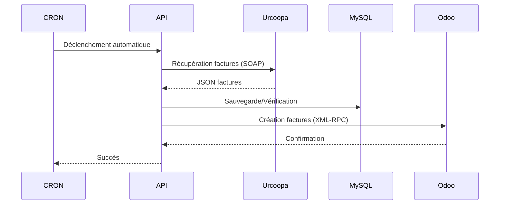
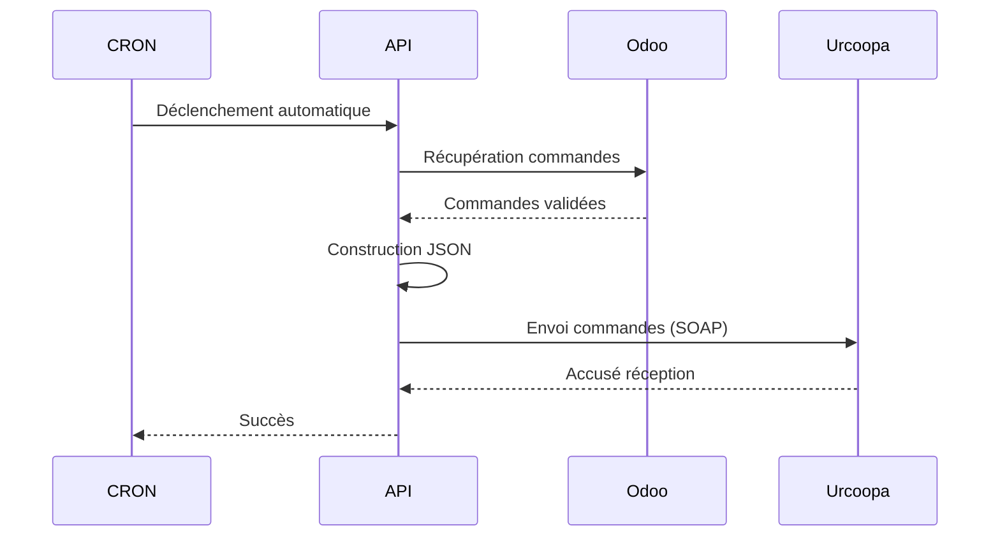
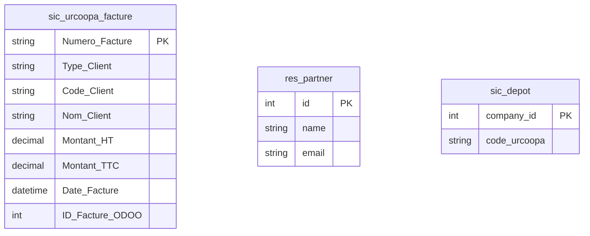

# 🚀 API Sicalait Urcoopa

[](https://python.org)
[](https://fastapi.tiangolo.com)
[](https://mysql.com)
[](LICENSE)

> **Interface de synchronisation entre Urcoopa, Gesica et Odoo pour la gestion automatisée des factures et commandes.**

## 🎯 Vue d'ensemble

Cette API FastAPI automatise la synchronisation des données entre trois systèmes critiques :

- **🏢 Urcoopa** - Système de facturation externe (SOAP)
- **📦 Gesica** - Gestion des commandes  
- **⚙️ Odoo** - ERP principal (XML-RPC)

### ✨ Fonctionnalités clés

- 🔄 **Synchronisation automatique** des factures Urcoopa → Odoo
- 📋 **Import des commandes** Gesica → Odoo  
- 📤 **Envoi des commandes** Odoo → Urcoopa
- 🌐 **Interface web** pour la gestion des factures adhérents
- ⏰ **Automatisation CRON** programmable
- 👥 **Gestion différenciée** Adhérents vs Magasins

## 🏗️ Architecture



## ⚡ Quick Start

### 1. **Installation**

```bash
# Cloner le repository
git clone <repository-url>
cd sicalait-urcoopa-api

# Installer les dépendances
pip install -r requirements.txt
```

### 2. **Configuration**

Créer le fichier `.env` :

```env
# Urcoopa API
MY_URCOOPA_URL=https://your-urcoopa-api.com/service.asmx?wsdl
API_KEY_URCOOPA=your_api_key
API_KEY_JOUR=30

# Base de données
MYSQL_HOST=HOST_DRESS
MYSQL_DATABASE=DATABASE
MYSQL_USER=ROOT
MYSQL_PASSWORD=your_password

# CRON Planning
CRONTAB_APP_FACTURES=00 6,12,18 * * *
CRONTAB_APP_COMMANDES=00 6,12,18 * * *
DATE_JOUR=5
```

### 3. **Démarrage**

```bash
# Lancement direct
python main.py

# Ou avec Uvicorn
uvicorn main:app --host 0.0.0.0 --port 9898
```

🌐 **Interface disponible sur :** `http://localhost:9898`

## 📊 Flux de données

### Synchronisation des factures (6h-12h-18h quotidien)



### Envoi des commandes (6h-12h-18h quotidien)



## 🛠️ API Endpoints

### 🌐 Interface Web
### Voir visuellement les factures récupérer

| Route | Méthode | Description |
|-------|---------|-------------|
| `/` | `GET` | 🏠 Dashboard principal |
| `/factureAdherentUrcoopa` | `GET` | 📋 Gestion factures adhérents |
| `/valider-facture` | `POST` | ✅ Validation facture |

### 🔄 API Synchronisation

| Route | Méthode | Description |
|-------|---------|-------------|
| `/factures/` | `GET` | 📥 Import factures Urcoopa |
| `/Commandes_Gesica` | `GET` | 📦 Import commandes Gesica |
| `/envoyer-commande/` | `POST` | 📤 Envoi commandes vers Urcoopa |

### 📝 Exemples d'utilisation

```bash
# Récupération manuelle des factures
curl "http://localhost:9898/factures/?xCleAPI=YOUR_KEY&nb_jours=30"

# Envoi des commandes
curl -X POST "http://localhost:9898/envoyer-commande/"

# Import des commandes Gesica
curl "http://localhost:9898/Commandes_Gesica"
```

## 📁 Structure du projet

```
📂 sicalait-urcoopa-api/
├── 📄 main.py                 # 🚀 Application principale
├── 📂 sql/
│   └── 📄 connexion.py       # 🗃️ Modèles Connexion
│   └── 📄 models.py          # 🗃️ Modèles CRUD
├── 📄 createOdoo.py          # 🔧 Création factures Odoo
├── 📄 createOdooGesica.py    # 🔧 Création commandes Gesica
├── 📄 testEnvoiAPI.py        # 📡 Client SOAP
├── 📂 templates/
│   ├── 📄 index.html         # 🏠 Page d'accueil
│   ├── 📄 factures.html      # 📋 Interface factures
│   └── 📄 confirmation.html  # ✅ Page confirmation
├── 📂 static/                # 🎨 Assets statiques
├── 📄 .env                   # ⚙️ Configuration
└── 📄 requirements.txt       # 📦 Dépendances
```

## ⏰ Automatisation CRON

L'application configure automatiquement les tâches CRON :

```bash
# 📥 Récupération factures - 6h00 - 12h00 -18h00 quotidien
00 6,12,18 * * * curl http://localhost:9898/factures/

# 📤 Envoi commandes - 6h00 - 12h00 -18h00 quotidien quotidien  
00 6,12,18 * * * curl -X POST http://localhost:9898/envoyer-commande/
```

**Configuration personnalisée :**
```env
CRONTAB_APP_FACTURES=00 6,12,18 * * *  # Format cron standard
CRONTAB_APP_COMMANDES=00 6,12,18 * * *   # Format cron standard
```

## 🗄️ Base de données

### Tables principales



## 🔧 Technologies utilisées

| Technologie | Usage | Version |
|-------------|-------|---------|
| **FastAPI** | Framework web | 0.68+ |
| **Zeep** | Client SOAP | 4.0+ |
| **MySQL Connector** | Base de données | 8.0+ |
| **Pandas** | Traitement données | 1.3+ |
| **Jinja2** | Templates web | 3.0+ |
| **Python-crontab** | Automatisation | 2.5+ |

## 🚀 Déploiement

### 🐳 Docker

```dockerfile
FROM ubuntu:22.04

ENV DEBIAN_FRONTEND=noninteractive
ENV PYTHONUNBUFFERED=1
ENV TZ=Indian/Reunion

RUN apt-get update -y && \
    apt-get install -y --no-install-recommends \
        curl \
        tzdata \
        python3 \
        python3-pip \
        nano \
        gcc \
        cron \
        build-essential \
        supervisor && \
    apt-get clean && \
    rm -rf /var/lib/apt/lists/*

RUN ln -fs /usr/share/zoneinfo/Indian/Reunion /etc/localtime

WORKDIR /app

ADD . /app/

COPY main.py requirements.txt server.crt server.key ./

RUN pip install --no-cache-dir -r requirements.txt

RUN rm /etc/localtime

RUN ln -s /usr/share/zoneinfo/Indian/Reunion /etc/localtime

COPY moncrontab /etc/cron.d/moncrontab
RUN chmod 0644 /etc/cron.d/moncrontab && \
    crontab /etc/cron.d/moncrontab && \
    touch /var/log/cron.log

EXPOSE 9898

CMD service cron start && \
    uvicorn main:app --host 0.0.0.0 --port 9898
```

```bash
# Build push et run
docker build -t urcoopa-api .
docker tag urcoopa-api:0.1 {your_account}/urcoopa-api:latest
docker push {your_account}/urcoopa-api:latest
docker run -p 9898:9898 urcoopa-api
```

### 🔄 Production

```bash
# Avec SSL
uvicorn main:app \
  --host 0.0.0.0 \
  --port 9898 \
  --ssl-certfile server.crt \
  --ssl-keyfile server.key
```

## 📊 Monitoring

### 📝 Logs système

L'application génère des logs détaillés :

```python
📤[INFO] Début connexion odoo
✅ Authentification réussie. UID: 123
📦 Traitement facture F2024001 (15 lignes)
✅📤 Commande Odoo créée ID: 456
❌ Erreur SOAP : Timeout connexion
```

### 🔍 Vérifications de santé

```bash
# Status API
curl http://localhost:9898/

# Vérification base de données
curl http://localhost:9898/factureAdherentUrcoopa
```

## 🛡️ Sécurité

- 🔐 **Authentification API** par clé
- 🔒 **Variables d'environnement** pour credentials
- 🚫 **Validation des entrées** utilisateur
- 📝 **Audit trail** complet
- 🔄 **Retry automatique** en cas d'échec

## 🐛 Dépannage

### Problèmes courants

| Problème | Solution |
|----------|----------|
| ❌ Connexion Odoo | Vérifier URL/credentials dans `.env` |
| ❌ Erreur SOAP Urcoopa | Contrôler `API_KEY_URCOOPA` |
| ❌ Base données MySQL | Vérifier connexion réseau `HOST` |
| ❌ CRON non exécuté | Redémarrer service cron : `service cron restart` |

### 📞 Debug mode

```bash
# Lancement avec logs détaillés
python main.py --log-level debug

# Test connexions
python -c "from main import *; print('✅ Connexions OK')"
```

## 🤝 Contribution

1. 🍴 **Fork** le repository
2. 🌿 **Créer** une branche feature : `git checkout -b feature/ma-fonctionnalite`
3. ✅ **Commiter** : `git commit -am 'Ajout fonctionnalité'`
4. 📤 **Push** : `git push origin feature/ma-fonctionnalite`
5. 🔄 **Pull Request**

### 📋 Checklist contribution

- [ ] Code testé et fonctionnel
- [ ] Documentation mise à jour
- [ ] Variables d'environnement documentées
- [ ] Logs ajoutés pour traçabilité

## 📜 Changelog

### Version 1.0.0 (Current)
- ✅ Synchronisation factures Urcoopa → Odoo
- ✅ Import commandes Gesica → Odoo
- ✅ Envoi commandes Odoo → Urcoopa
- ✅ Interface web gestion adhérents
- ✅ Automatisation CRON

## 📞 Support

- 📧 **Email :** info.sdpma@sicalait.fr
- 📱 **Téléphone :** +262 XXX XXX XXX
- 🐛 **Issues :** [GitHub Issues](issues)
- 📖 **Wiki :** [Documentation complète](wiki)

## 📄 Licence

**Propriétaire Sicalait** - Tous droits réservés

---

<div align="center">

**🚀 Développé avec ❤️ par l'équipe Sicalait**

*Automatisation • Performance • Fiabilité*

</div>