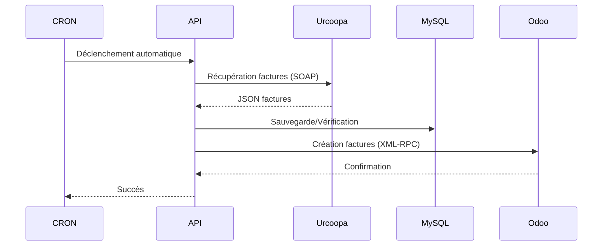
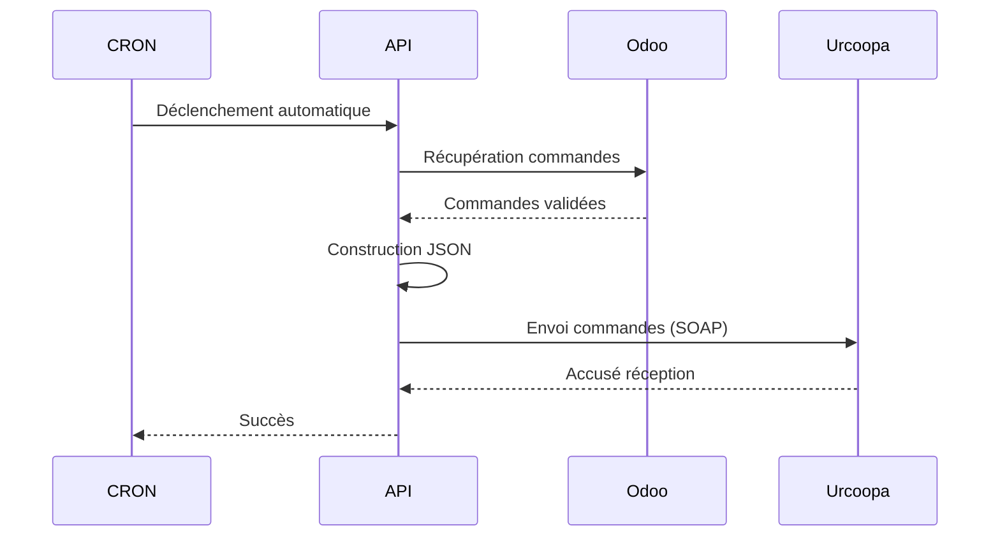
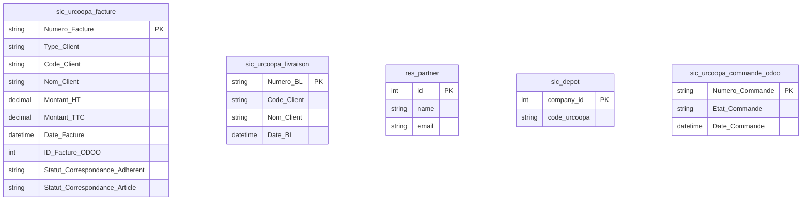
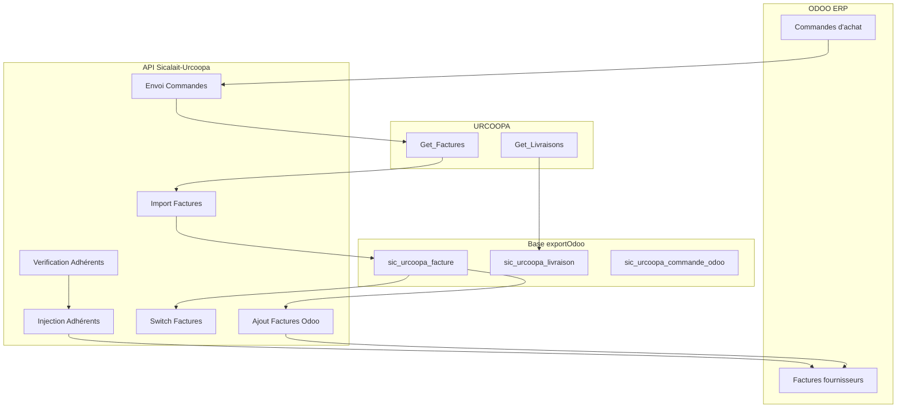

<div align="center">

# 🚀 API Sicalait Urcoopa

[](https://python.org)
[](https://fastapi.tiangolo.com)
[](https://mysql.com)
[](LICENSE)

**Interface de synchronisation entre Urcoopa, Gesica et Odoo pour la gestion automatisée des factures et commandes.**

</div>

## 🎯 Vue d'ensemble

Cette API FastAPI automatise la synchronisation des données entre trois systèmes critiques :

- **🏢 Urcoopa** - Système de facturation externe (SOAP)
- **📦 Gesica** - Gestion des commandes
- **⚙️ Odoo** - ERP principal (XML-RPC)

### ✨ Fonctionnalités clés

- 🔄 Synchronisation automatique **Urcoopa ↔ Odoo**
- 📋 Import / export de commandes Gesica
- 🧾 Gestion et validation des factures adhérents
- 🧩 Détection des correspondances clients / articles
- ⏰ Automatisation complète via **CRON**
- 🌐 Interface Web interne pour la supervision
- 📈 Tableaux de bord et statistiques temps réel

---

## 🏗️ Architecture

```mermaid
graph LR
    A[Urcoopa SOAP] --> B[FastAPI API]
    C[Gesica DB] --> B
    B --> D[MySQL ExportOdoo]
    B --> E[Odoo XML-RPC]
    B --> F[Interface Web (Jinja2)]

    style B fill:#e1f5fe
    style D fill:#fff3e0
    style E fill:#c8e6c9
```

## ⚡ Quick Start

### 1. **Installation**

```bash
# Cloner le repository
git clone <repository-url>
cd urcoopa

# Installer les dépendances
pip install -r requirements.txt
```

### 2. **Configuration**

Créer le fichier `.env` :

```env
# Urcoopa API
MY_URCOOPA_URL=https://your-urcoopa-api.com/service.asmx?wsdl
API_KEY_URCOOPA=your_api_key
API_KEY_JOUR=30

URL_ODOO=
DB_ODOO=
USERNAME_ODOO=
PASSWORD_ODOO=

API_KEY_JOUR_FACTURES=15
API_KEY_DATE_REFERENCE=2025-06-01

# Base de données
MYSQL_HOST=HOST_DRESS
MYSQL_DATABASE=DATABASE
MYSQL_USER=ROOT
MYSQL_PASSWORD=your_password

# CRON Planning
DATE_JOUR=5
CRONTAB_APP_FACTURES=17 11 * * *           # 11h00 - Récupération factures
CRONTAB_APP_RECUPERE_LIVRAISON=20 11 * * *  # 11h10 - Récupération livraison (+10min)
CRONTAB_APP_SWITCH_FACTURES=25 11 * * *     # 11h20 - Switch factures (+10min)
CRONTAB_APP_AJOUT_FACTURE_DANS_ODOO=35 11 * * * # 11h30 - Ajout facture odoo (+10min)
CRONTAB_APP_VERIF_CORRESPONDANT=27 11 * * * # 11h40 - Vérification correspondant (+10min)
CRONTAB_APP_INJECTION_CORRESPONDANT=30 11 * * * # 11h50 - Injection correspondant (+10min)
CRONTAB_APP_COMMANDES=40 11 * * *           # 12h00 - Envoi commandes (+10min)


#Uptime
UPTIME_KUMA_PUSH_URL_FACTURES=https://www....
UPTIME_KUMA_PUSH_URL_LIVRAISON=https://www....
UPTIME_KUMA_PUSH_URL_AJOUT_FACTURE_ODOO=https://www....
UPTIME_KUMA_PUSH_URL_SWITCH_FACTURE_ODOO=https://www....
UPTIME_KUMA_PUSH_URL_VERIF_CORRESPONDANCE_ADHRENT=https://www....
UPTIME_KUMA_PUSH_URL_INJECTION_CORRESPONDANCE_ADHRENT=https://www....
UPTIME_KUMA_PUSH_URL_COMMANDES=https://www....
```

### 3. **Démarrage**

```bash
# Lancement direct
python main.py

# Ou avec Uvicorn
uvicorn main:app --host 0.0.0.0 --port 9898
```

🌐 **Interface disponible sur :** `http://localhost:9898`

## 📊 Flux de données

### Synchronisation des factures (1h-6h quotidien)



### Envoi des commandes (18h30 quotidien)



## 🛠️ API Endpoints

### 🌐 Interface Web
### Voir visuellement les factures récupérées

| Route | Méthode | Description |
|-------|----------|-------------|
| `/` | `GET` | 🏠 Dashboard principal |
| `/factureAdherentUrcoopa` | `GET` | 📋 Liste et gestion des factures adhérents |
| `/valider-facture/{numero}` | `POST` | ✅ Validation d’une facture spécifique |

---

### 🔄 API Synchronisation  

| Route | Méthode | Description |
|-------|----------|-------------|
| `/Recupere_Factures/` | `GET` | 📥 Récupère les factures depuis Urcoopa (SOAP) |
| `/ajout-facture-odoo` | `GET` | 🧾 Crée les factures correspondantes dans Odoo |
| `/recupere_livraison/` | `GET` | 🚚 Récupère les livraisons Urcoopa |
| `/envoyer-commande/` | `POST` | 📤 Envoie les commandes Odoo → Urcoopa |
| `/switch-facture-apres-reception` | `GET` | 🔁 Bascule les commandes réceptionnées en facturées |

---

### 👥 Correspondances & Adhérents  

| Route | Méthode | Description |
|-------|----------|-------------|
| `/api/verification-correspondance-adherent` | `GET` | 🔍 Vérifie les correspondances adhérents/articles |
| `/api/injection-dans-odoo-donnees-adherent` | `GET` | 🧩 Injecte dans Odoo les factures adhérents reconnues |
| `/reset_table_adherent_article` | `DELETE` | 🧹 Réinitialise les tables de non-correspondance |

---

### 📊 Comptabilité & Statistiques  

| Route | Méthode | Description |
|-------|----------|-------------|
| `/api/donnees-comptables/{annee}/{mois}` | `GET` | 📈 Données comptables mensuelles |
| `/valider-toutes-factures` | `POST` | ✅ Validation groupée des factures |
| `/les_inconnus` | `GET` | ❓ Liste des clients ou articles inconnus |
| `/export_inconnus/{type}` | `GET` | 💾 Exporte les éléments inconnus (CSV) |

---

### 📝 Exemples d'utilisation

```bash
# 📥 Récupération manuelle des factures Urcoopa
curl "http://localhost:9898/Recupere_Factures/?xCleAPI=YOUR_KEY&nb_jours=30"

# 📤 Envoi des commandes Odoo → Urcoopa
curl -X POST "http://localhost:9898/envoyer-commande/"

# 🔍 Vérification des correspondances adhérents
curl "http://localhost:9898/api/verification-correspondance-adherent"

# 🧾 Injection automatique des factures adhérents reconnues
curl "http://localhost:9898/api/injection-dans-odoo-donnees-adherent"
```

## 📁 Structure du projet

```
📂 sicalait-urcoopa-api/
├── 📄 main.py                  # 🚀 Application principale FastAPI
├── 📂 sql/
│   ├── 📄 connexion.py         # 🔌 Connexion MySQL
│   └── 📄 models.py            # 🧱 Modèles CRUD et logique SQL
├── 📂 odoo/
│   └── 📂 controller/          # ⚙️ Automatisation Odoo (XML-RPC)
│       ├── statutSwitchDropShipping.py
│       ├── creationFactureDansOdoo.py
│       └── boucleCommandeUrcoopa.py
├── 📄 createOdoo.py            # 🔧 Création de factures Odoo
├── 📄 createAdherentOdoo.py    # 🔧 Création de factures adhérents
├── 📄 createOdooGesica.py      # 🔧 Import commandes Gesica
├── 📂 templates/
│   ├── 📄 index.html           # 🏠 Page principale
│   ├── 📄 factures.html        # 📋 Interface factures adhérents
│   └── 📄 confirmation.html    # ✅ Page de confirmation
├── 📂 static/                  # 🎨 Fichiers CSS / JS
├── 📄 .env                     # ⚙️ Configuration de l'environnement
└── 📄 requirements.txt         # 📦 Dépendances Python

```

## ⏰ Exemple Automatisation CRON

L'application configure automatiquement les tâches CRON :

```bash
# 📥 Récupération des factures Urcoopa
00 6,12,18 * * * curl http://localhost:9898/Recupere_Factures/

# 📤 Envoi des commandes Odoo → Urcoopa
00 6,12,18 * * * curl -X POST http://localhost:9898/envoyer-commande/

# 🧾 Ajout des factures dans Odoo
15 6,12,18 * * * curl http://localhost:9898/ajout-facture-odoo
```

**Exemple Configuration personnalisée :**
```env
CRONTAB_APP_FACTURES=00 6,12,18 * * *
CRONTAB_APP_COMMANDES=00 6,12,18 * * *
CRONTAB_APP_AJOUT_FACTURE_DANS_ODOO=15 6,12,18 * * *
```

## 🗄️ Base de données

### Tables principales



## 🔧 Technologies utilisées

| Technologie | Usage | Version |
|-------------|-------|---------|
| **FastAPI** | Framework web | 0.68+ |
| **Zeep** | Client SOAP | 4.0+ |
| **MySQL Connector** | Base de données | 8.0+ |
| **Pandas** | Traitement données | 1.3+ |
| **Jinja2** | Templates web | 3.0+ |
| **Python-crontab** | Automatisation | 2.5+ |
| **XML-RPC** | Communication Odoo | Intégré |
| **Uptime Kuma API** | Monitoring applicatif | optionnel |

## 🚀 Diagramme global du flux applicatif



## 🚀 Déploiement

### 🐳 Docker

```dockerfile
FROM ubuntu:22.04

ENV DEBIAN_FRONTEND=noninteractive
ENV PYTHONUNBUFFERED=1
ENV TZ=Indian/Reunion

RUN apt-get update -y && \
    apt-get install -y --no-install-recommends \
        curl \
        tzdata \
        python3 \
        python3-pip \
        nano \
        gcc \
        cron \
        build-essential \
        supervisor && \
    apt-get clean && \
    rm -rf /var/lib/apt/lists/*

RUN ln -fs /usr/share/zoneinfo/Indian/Reunion /etc/localtime

WORKDIR /app

ADD . /app/

COPY main.py requirements.txt server.crt server.key ./

RUN pip install --no-cache-dir -r requirements.txt

RUN rm /etc/localtime

RUN ln -s /usr/share/zoneinfo/Indian/Reunion /etc/localtime

COPY moncrontab /etc/cron.d/moncrontab
RUN chmod 0644 /etc/cron.d/moncrontab && \
    crontab /etc/cron.d/moncrontab && \
    touch /var/log/cron.log

EXPOSE 9898

CMD service cron start && \
    uvicorn main:app --host 0.0.0.0 --port 9898
```

```bash

# Build push et run
docker build -t urcoopa-api .
docker tag urcoopa-api:0.1 {your_account}/urcoopa-api:latest
docker push {your_account}/urcoopa-api:latest
docker run -p 9898:9898 urcoopa-api

```

### 🔄 Production

```bash
# Avec SSL
uvicorn main:app \
  --host 0.0.0.0 \
  --port 9898 \
  --ssl-certfile server.crt \
  --ssl-keyfile server.key
```

## 📊 Monitoring

### 📝 Logs système

L'application génère des logs détaillés :

```python
📤[INFO] Début connexion odoo
✅ Authentification réussie. UID: 123
📦 Traitement facture F2024001 (15 lignes)
✅📤 Commande Odoo créée ID: 456
❌ Erreur SOAP : Timeout connexion
```

### 🔍 Vérifications de santé

```bash
# Status API
curl http://localhost:9898/

# Vérification base de données
curl http://localhost:9898/factureAdherentUrcoopa
```

## 🛡️ Sécurité

- 🔐 **Authentification API** par clé
- 🔒 **Variables d'environnement** pour credentials
- 🚫 **Validation des entrées** utilisateur
- 📝 **Audit trail** complet
- 🔄 **Retry automatique** en cas d'échec

## 🐛 Dépannage

### Problèmes courants

| Problème | Solution |
|----------|----------|
| ❌ Connexion Odoo | Vérifier URL/credentials dans `.env` |
| ❌ Erreur SOAP Urcoopa | Contrôler `API_KEY_URCOOPA` |
| ❌ Base données MySQL | Vérifier connexion réseau `HOST` |
| ❌ CRON non exécuté | Redémarrer service cron : `service cron restart` |

### 📞 Debug mode

```bash
# Lancement avec logs détaillés
python main.py --log-level debug

# Test connexions
python -c "from main import *; print('✅ Connexions OK')"
```

## 🤝 Contribution

1. 🍴 **Fork** le repository
2. 🌿 **Créer** une branche feature : `git checkout -b feature/ma-fonctionnalite`
3. ✅ **Commiter** : `git commit -am 'Ajout fonctionnalité'`
4. 📤 **Push** : `git push origin feature/ma-fonctionnalite`
5. 🔄 **Pull Request**

### 📋 Checklist contribution

- [ ] Code testé et fonctionnel
- [ ] Documentation mise à jour
- [ ] Variables d'environnement documentées
- [ ] Logs ajoutés pour traçabilité

## 📜 Changelog

### Version 1.0.0 (Current)
- ✅ Synchronisation factures Urcoopa → Odoo
- ✅ Import commandes Gesica → Odoo
- ✅ Envoi commandes Odoo → Urcoopa
- ✅ Interface web gestion adhérents
- ✅ Automatisation CRON

## 📞 Support

- 📧 **Email :** info.sdpma@sicalait.fr
- 📱 **Téléphone :** +262 XXX XXX XXX
- 🐛 **Issues :** [GitHub Issues](issues)
- 📖 **Wiki :** [Documentation complète](wiki)

## 📄 Licence

**Propriétaire Sicalait** - Tous droits réservés

---

<div align="center">

**🚀 Développé avec ❤️ par l'équipe Sicalait**

*Automatisation • Performance • Fiabilité*

</div>