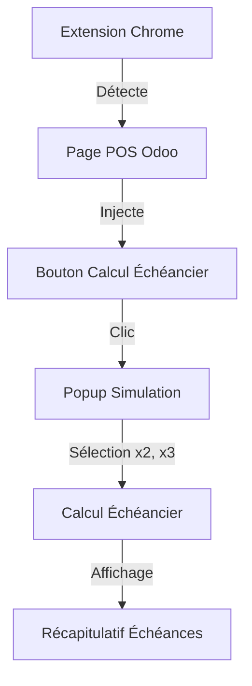
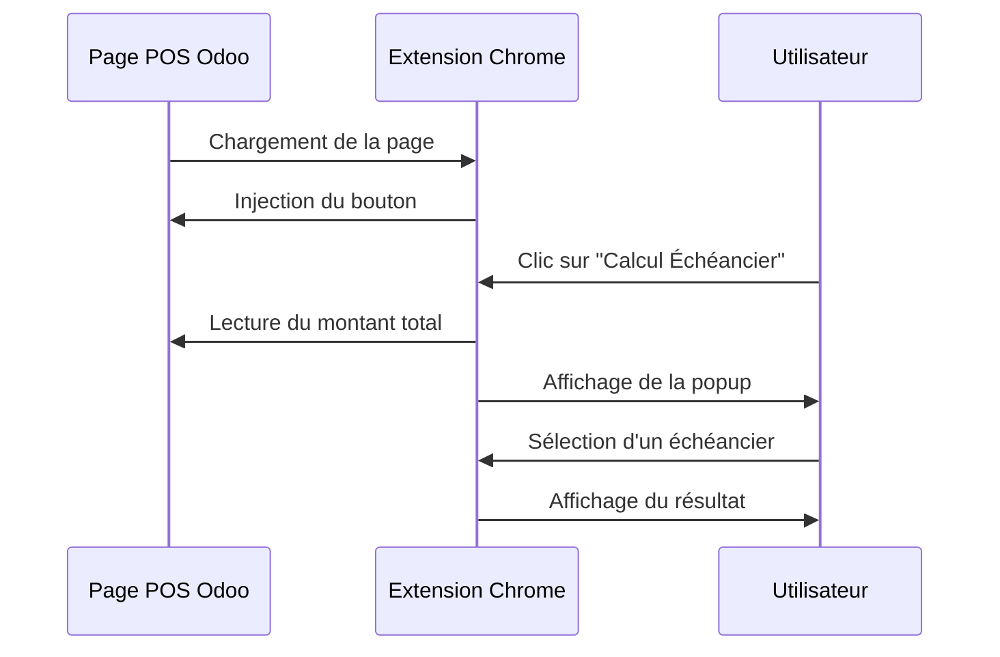

# 🛍️ Odoo POS - Extension Calcul Échéancier CB

Extension Chrome pour afficher un échéancier de paiement CB directement dans l'interface POS d'Odoo.

## 🎯 Fonctionnalités

- 🔘 Ajoute un bouton "Calcul Échéancier" dans l'interface POS
- 🖩 Calcul automatique des échéances (x2, x3...)
- 🌐 Compatible avec toutes les instances Odoo (cloud et auto-hébergées)
- 🔄 Injection automatique du bouton lors du chargement de la page
- 📊 Logs détaillés dans la console pour le débogage

## 🔧 Installation

1. Clonez ce dépôt :
```bash
git clone https://github.com/wad974/chrome_extension_odoo_pos_echeancier.git
```

2. Installez l'extension dans Chrome :
   - Ouvrez Chrome et allez dans le menu (⋮) > Plus d'outils > Extensions
   - Activez le "Mode développeur" en haut à droite
   - Cliquez sur "Charger l'extension non empaquetée"
   - Sélectionnez le dossier du projet


## 🏗️ Architecture



## 🔄 Flux de fonctionnement



## 📋 Prérequis

- Google Chrome
- Instance Odoo avec module Point de Vente (POS)

## 📖 Documentation

### Interface POS Odoo


*Vue générale de l'interface POS Odoo 17*


*Le bouton "Calcul CB X2 X3" ajouté par l'extension*


*Le champs "Calcul CB X2 X3" ajouté par l'extension*


*Le calcul échéancier "CB X2" éffectué aprés choix*


*Le calcul échéancier "CB X3" éffectué aprés choix*

## 🔍 Débogage

1. Ouvrez la console développeur (F12)
2. Observez les logs :
   - "Extension calcul échéancier chargée"
   - "Page POS détectée"
   - "Injection réussie"
   - "Bouton calculatrice ajouté avec succès"

## 📝 Changelog

### Version 1.0.0 (13/03/2024)
- ✨ Première version stable
- 🎯 Injection automatique du bouton
- 🔄 Détection des montants total
- 🌐 Support de toutes les instances Odoo
- 📊 Logs de débogage

### Prochaines évolutions prévues
- [ ] Rendre dynamique le montant total lors de l'ajout d'article

## 🤝 Contribution

Les contributions sont les bienvenues ! N'hésitez pas à :
1. Fork le projet
2. Créer une branche pour votre fonctionnalité
3. Commiter vos changements
4. Pousser vers la branche
5. Ouvrir une Pull Request

## 📄 Licence

Ce projet est sous licence MIT. Voir le fichier [LICENSE](LICENSE) pour plus de détails.

## 🔗 Liens utiles

- [Documentation Odoo POS](https://www.odoo.com/documentation/17.0/applications/sales/point_of_sale.html)
